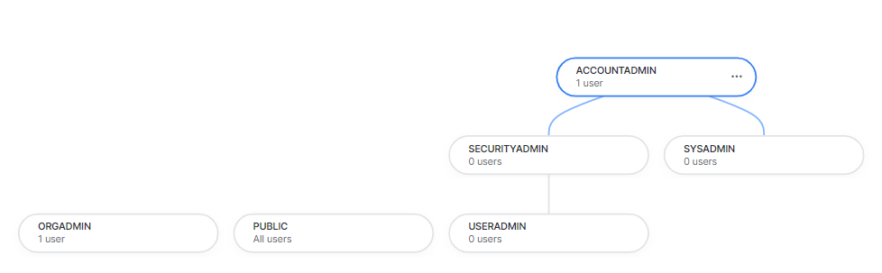

- *Identity*: who you are
- *Access*: what you are allowed to see
- *Authenticated*: 
    - Proving identity
    - e.g: SCIM, FEDAUTH, MFA, IdP, SSO, SAML
- *Authorized*:
    - To prove that you have right to access something
    - e.g: DISCRETIONARY, ROLE_BASED, IP POLICIES

- *Role Based Access Control* 
    - RBAC
    - Roles are assigned to users and users can switch between roles.

- ACCOUNTADMIN role has most access and power.

- Snowflake's 5 pre-defined RBAC roles

    

    - ACCOUNTADMIN: Account administrator can manage all aspects of the account.

    - SYSADMIN: System administrator can create and manage databases and warehouses.

    - SECURITYADMIN: Security administrator can manage security aspects of the account.

    - USERADMIN: User administrator can create and manage users and roles.

    - PUBLIC: Public role is automatically available to every user in the account.

    - ORGADMIN: Organization administrator can manage organizations and accounts in organizations.

- Default role for trial account is ACCOUNTADMIN.

- Roles can get subsets of rights from other roles.

- BECAUSE OF BOGO (Buy one get one free), HIGHER ROLES CAN IMPERSONATE LOWER ROLES. 

- If a USER has a higher role, they will be able to impersonate all lower ROLES in the same linked tree, without being explicitly given those ROLES.  

- Besides RBAC, another facet of Snowflake's access model called **Discretionary Access Control (DAC)**, which means *"you create it, you own it."* If SYSADMIN creates a database, they own it and so they can delete it, change the name, and more.

- Because of the combination of RBAC and DAC in Snowflake, when we create something, the ROLE we were using at the time we created it, is the role that OWNS it.

- In Snowflake, rights and privileges are awarded to ROLES.

- In Snowflake, OWNERSHIP of items belongs to ROLES.

- Higher Roles Have Custodial Oversight: 

    - ACCOUNTADMIN can take the database away from SYSADMIN and give it to a SECURITYADMIN if they want to.

    - ACCOUNTADMIN can also delete something owned by SYSADMIN, rename it, or carry out any other task on anything created or owned by SYSADMIN. SYSADMIN cannot do the same things to items owned by ACCOUNTADMIN. 

    - If SECURITYADMIN owns a ROLE, ACCOUNTADMIN can change the name.

- Default Role Assignment:

    - Each USER has a role assigned as their default.
    
    - This just means that each time you log in to Snowflake, your role will be set to ACCOUNTADMIN.

- Databases are used to group datasets (tables) together. 

- A second-level organizational grouping, within a database, is called a schema. 

- Every time you create a database, Snowflake will automatically create two schemas for you.

    - The INFORMATION_SCHEMA schema holds a collection of views.  The INFORMATION_SCHEMA schema *cannot* be deleted (dropped), renamed, or moved.

    - The PUBLIC schema is created empty and you can fill it with tables, views and other things over time. The PUBLIC schema *can* be dropped, renamed, or moved at any time.