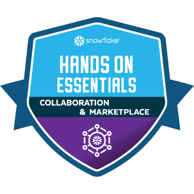

## Hands-On Essentials: Collaboration, Marketplace & Cost Estimation Workshop

----

**Skills/Knowledge**

- SQL Basics
- SQL Intermediate
- SQL Block Scripting/Control-of-Flow
- Snowflake COPY INTO
- File Formats
- Snowflake Cost Categories
- Snowflake on Azure
- Snowflake on GCP
- Snowflake Data Marketplace
- SQL UPDATE
- SQL Cursor
- COPY INTO with Column Count Mismatch
- Local SQL Variables
- Secure UDTFs
- Secure Views
- Data Listing Development
- Snowflake Provider Studio
- Data Loading with Column Name Matching
- Snowflake ORGADMIN Role
- Snowflake Account Creation