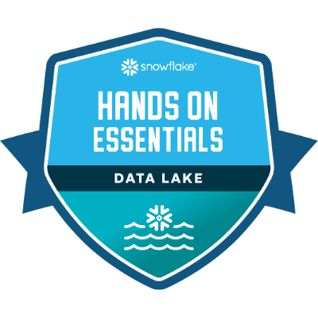

## Hands-On Essentials: Data Lake Warehouse

----

**Skills/Knowledge**

- Snowflake Stages
- Querying Staged Data
- File Formats
- Directory Tables
- Parquet
- GeoSpatial Functions
- geoJSON
- Snowflake User Defined Functions
- Marketplace Data Shares
- External Tables