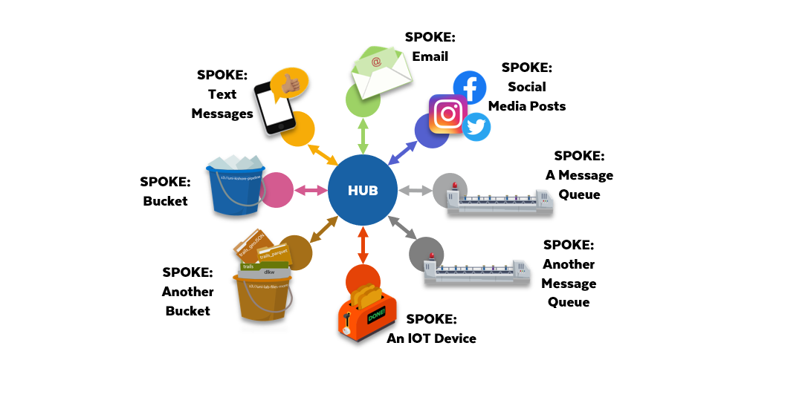

### Cloud-Based Services

- Event-Driven Pipeline in Snowflake depends on 3-types of services created and managed by the cloud providers:

    1. Storage Service:
        - AWS S3 Buckets
        - Azure Blob Storage
        - GCP GCS Buckets
    2. Publish & Subscribe Notification Service (PUB/SUB):
        - AWS Simple Notification Services (SNS)
        - Azure Web PubSub and Azure Event Hub
        - GCP Cloud Pub/Sub
    3. Message Service (QUEUE)
        - AWS Simple Queue Services (SQS)
        - Azure Storage Queues and Azure Service Bus Queues
        - GCP Cloud Tasks

**Pub/Sub Services**

- Pub/Sub services are based on a Hub and Spoke pattern.

    - **HUB**: Central controller that manages the receiving and sending of messages.

    - **SPOKES**: Solutions and services that either send or receive notifications from the HUB.

- A SPOKE can be both publisher and a Subscriber:
    
    - If a SPOKE is a PUBLISHER, that means they send messages to the HUB.
    - If a SPOKE is a SUBSCRIBER, they receive messages from the HUB.

    

- With messages flowing into and out of a Pub/Sub service from so many places, it could get confusing, fast. 

- Pub/Sub services have EVENT NOTIFICATIONS and TOPICS. 

- A **topic** is a collection of event types. 

- A SPOKE publishes NOTIFICATIONS to a TOPIC and subscribes to a TOPIC, which is a stream of NOTIFICATIONS. 

- The data being written to the stage files only covers a three-day period