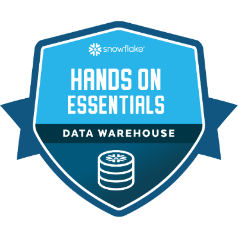
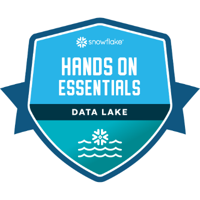
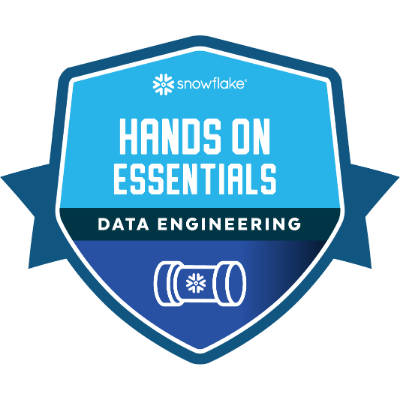
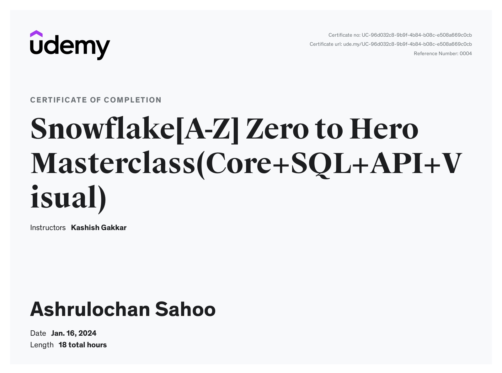

### ❄️ Snoflake Study Materials ❄️

----

This is a personal repository with materials, notes, exercises of Snowflake.

Followed Materials

- Snowflake Badge Series

- Snowflake Documents

- Snowflake Level Up 100 Series

- Snowflake A-Z Masterclass (Udemy)

- Snowflake Definitive Guide

-----

**Snowflake Badges**

   

-----

**Udemy Certification**

