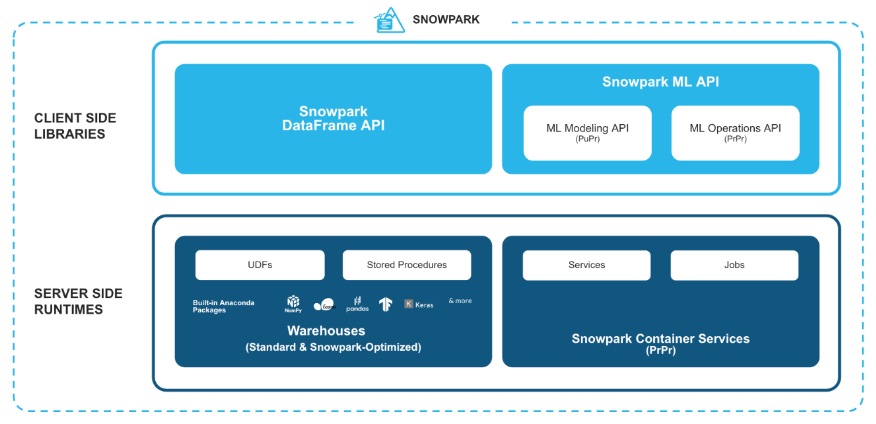

- **Snowpark** is a developer framework built inside of Snowflake, allowing users to use their favorite programming languages like Python, Java, Scala for direct interaction with Snowflake's cloud-based data platform.

- Snowpark's integration with Python enables Datafrmae-style programming in Snowflake.

- This integration allows to perform complex data analysis, develop machine learning models, and build data-driven applications.

**How Snowpark Works**

- Snowpark consists of both a client-side library and a server-side sandbox.

    

- The *Client-side library (Python coding environment)* is similar to a toolkit that Python developers have on their own computers.

- The *Server-Side Sandbox (Snowflake's secure environment)* is a secure isolated space provided by Snowflake on its servers. The Python code is executed in this sandbox. By this, the computations happen on Snowflake's powerful servers. Additionally, this layer provides a secure environment.

**Key Features of Snowpark**

- Easy data handling with dataframes.

- Take advantage of Snowflake's performance engine.

- Custom code with User-Defined Functions (UDFs).

- There are two libraries to use snowflake remotely.

    1. `snowflake-snowpark-python`: works like spark or pandas
    2. `snowflake-connector-python`: odbc connector for snowflake

- By using the collect method, a dataframe in snowpark can be persisted.

- When `df.show()` is collected, the transformation dataframe is displayed, but *not stored in memory*.