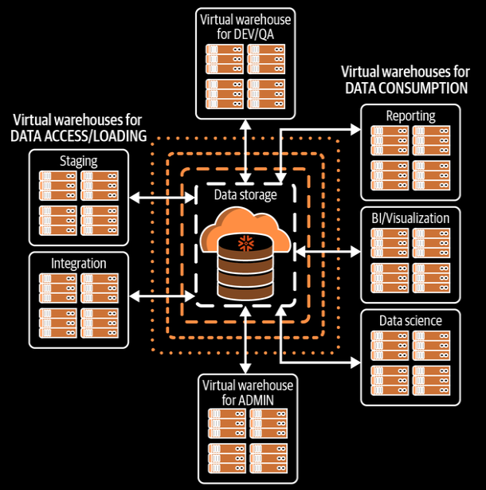

- **Compute Layer/Virtual Warehouse Continued**:
  
  - Commands for virtual warehouse like creating, resizing, scaling, resuming or shutting a cluster down can be done via both Web UI or within a worksheet using SQL.
  
  - *Auto Suspend*: The number of seconds that the virtual warehouse will wait if no queries need to be executed before going offline.
  
  - *Auto Resume*: The virtual warehouse resumes if there is an operation that requires compute resources.
  
  - While creating a virtual warehouse using SQL, you'll need to state the suspend time in total seconds.
  
  - It is best practice to create a new virtual warehouse in a suspended state.
  
  - Warehouse Create query
    
    ```sql
    USE ROLE SYSADMIN;
    
    CREATE OR REPLACE WAREHOUSE EXAMPLE_WH WITH
      WAREHOUSE_SIZE = MEDIUM
      MIN_CLUSTER_COUNT = 1
      MAX_CLUSTER_COUNT = 6
      SCALING_POLICY = 'STANDARD'
      AUTO_SUSPEND = 300
      AUTO_RESUME = true
      INTITIALLY_SUSPENDED = true;
    ```
  
  - Resizing a virtual warehouse
    
    ```sql
    USE ROLE SYSADMIN;
    
    ALTER WAREHOUSE EXAMPLE_WH
    SET WAREHOUSE_SIZE = LARGE;
    ```
  
  - To specify to use a warehouse in a worksheet
    
    ```sql
    USE WAREHOUSE EXAMPLE_WH;
    ```
  
  - A multicluster virtual warehouse is said to be Maximized when the minimum number of clusters and maximum number of clusters are the same.
  
  - Workloads can be assigned to different virtual warehouses based on different users or groups of users.
  
  - Different groups of users can be assigned to different Snowflake virtual warehouses of varying size. 
    
    
  
  - Consumption charges for Snowflake virtual warehouses are calculated based on:
    
    - Warehouse size
    
    - Number of clusters in a virtual warehouse.
    
    - The amount of time each cluster server runs.
  
  - ACCOUNTADMIN role can view the virtual warehouse credit usage for an account. (Account -> Usage)

- **Storage Layer**:
  
  - Storage layer holds all data including structured and unstructured data.
  
  - As data is loaded into Snowflake, it is optimally reorganized into a compressed, columnar format and stored and maintained in Snowflake databases.
  
  - Each Snowflake database consists of one or more *Schemas*, which logically groups the database objects.
  
  - Data stored in Snowflake database is always compressed and encrypted.
  
  - Snowflake automatically organizes stored data into <u>*micro-partitions*, an optimized, immutable, compressed columnar format which is encrypted used AEX-256 encryption</u>.
  
  - There's no limit on the amount of data can be stored in Snowflake or the number of databases or database objects can be created.
  
  - There's no effect on virtual warehouse size as the storage increases or decreases in a Snowflake account.
  
  - Snowflake's data storage layer is sometimes referred to as the remote disk layer.
  
  - The <u>two unique features of Snowflake storage layer are *zero-copy cloning*, and *Time Travel*</u>.
  
  - Zero-copy cloning feature is to create a *snapshot* of the data without any additional storage charge.
  
  - Zero-copy cloning is a metadata-only operation.
  
  - The cloned data does not incur any cost until there's any modification to the data.
  
  - Time Travel allows to restore a previous version of a database, table or schema.
  
  - Snowflake data storage costs are calculated based on the daily average size of compressed data. 
  
  - Storage costs include:
    
    - Persistent data stored in permanent tables
    
    - Files staged for bulk data loading and unloading
    
    - Fail-safe data and time-travel data
    
    - Modified cloned data

**Snowflake Caching**

- There are three Snowflake caching types:
  
  - The query result cache
  
  - The virtual warehouse cache
  
  - Metadata cache

- **Query Result Cache**
  
  - Query are cached or persisted for 24 hours and then purged.
  
  - This query result purge clock is reseted everytime the results are queried again, up to maximum of 31 days from the date and time when the query was first executed.
  
  - When the underlying data changes, the new results are query with the query.
  
  - Result cache is fully manged by Snowflake global cloud service layer.
  
  - When result cache exceeds the cloud service cache, the results are stored in cloud storage.
  
  - Use of result cache doesn't need any running virtual warehouse.
  
  - It is the only cache that can be desabled by parameter.
    
    ```sql
    ALTER SESSION SET USE_CACHED_RESULT=FALSE;
    ```
    
    <i>Disabling the result cache is necessary before performing A/B testing</i>.
  
  - Any user with necessary privileges can access result cache. 

- **Metadata Cache**
  
  - Fully managed in the Service layer.
  
  - User has control over the metadata, but not over the cache.
  
  - Snowflake collects and manages metadata about tables, micro-partitions, and even clustering.
  
  - Snowflake stores row count, table size in bytes, file references, and table version for a table as metadata.
  
  - Using any metadata information doesn't need running virtual warehouse.
  
  - Snowflake metadata repository includes:
    
    - Table definitions
    
    - micro-partition file data like range of values in terms of MIN and MAX, NULL count, number of distinct values 
    
    - Total number of micr-partitions
    
    - Depth of overlapping micro-partitions (cluster depth)
  
  - <u>The information stored in the metadata cache is used to build the query execution plan.</u>

- **Virtual Warehouse Local Disk Cache**
  
  - Also referred as *raw data cache*, *SSD cache*, or *data cache*.
  
  - Implemented in Virtual warehouse layer.
  
  - Size of the virtual warheouse (SSD) cache is determined by the size of the virtual warehouse's compute resources.
  
  - The Virtual warehouse data cache is limited in size and uses the LRU (Least Recently Used) algorithm.
  
  - Whenever a virtual warehouse receives a query to execute, that warehouse will scan the SSD cache first before accessing the Snowflake remote disk storage.
  
  - Reading from SSD is faster than from the database storage layer but still requires the use of a running virtual warehouse.
  
  - Each data cache is specific to the virtual warehouse.
  
  - 