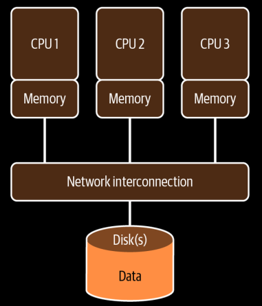
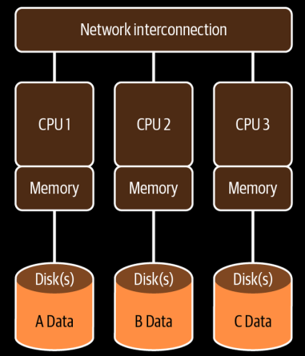
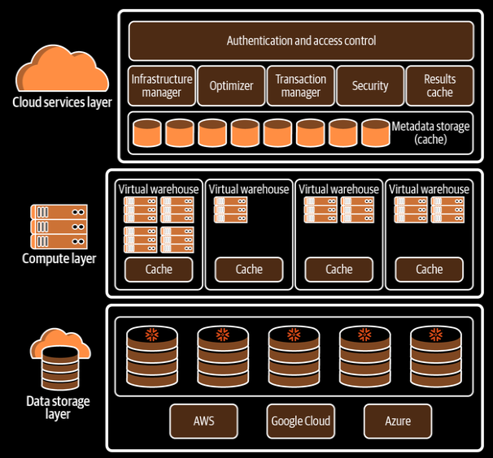

**Shared-Disk Architecture**

- Data is stored in a central storage location and is accessible from multiple database cluster nodes.

- Data is constantly available to all cluster nodes.

- All data modifications are written to the shared disk.

- _Limitations_:
  
  - Limited by the performance of the disk.
  
  - Requires complex on-disk locking mechanism to ensure data consistency, which causes <u>bottlenecks</u>.
  
  - Data concurrency problem
  
  - Adding more compute nodes

- _Example_: Oracle RAC

**Shared-Nothing Architecture**

- Storage and compute are scaled together.

- _Limitations_:
  
  - Limited by the need to distribute and query data across nodes.
  
  - <u>Overhead</u>: Distributed cluster nodes along with the associated disk storage, CPU, and memory requires data to be shuffled between nodes.
  
  - Resizing a cluster is time consuming.

- _Example_: IBM DB2, Vertica, and Pivotal Greenplum.

**NoSQL Databases - _"Not Only SQL"_**

- Shared -nothing architecture.

- Stores nonrelational data without first requiring transformation of the data.

- Does not require schema.

- Good choice for storing email, web links, social media posts and tweets, road maps, and spatial data.

- There are <u>four</u> types of NoSQL DBs:
  
  1. Document stores: _MongoDB_
  
  2. Key-value (KV) stores: _DynamoDB_
  
  3. Column family data stores / Wide column data stores: _Cassandra_
  
  4. Graph DBs: _Neo4j, Amazon Neptune_

- Great for Create Read Update and Delete (CRUD) operations.

- <i>Limitations</i>:
  
  - Poor performance on complex calculations like aggregations, window functions, arbitrary ordering, etc.
  
  - Not recommended for ad-hoc analysis
  
  - Users need specialized skills and not compatible with SQL-based tools.

**Snowflake Architecture**

- Storage and compute are physically separated, but logically integrated.

- Snowflake is composed of three layers:
  
  1. Cloud Service Layer,
  
  2. Query Processing / Virutal Warehouse/ Compute Layer
  
  3. Centralized hybrid columnar Database / Storage Layer

- **Cloud Service Layer**
  
  - <i>Brain</i> of Snowflake.
  
  - Enables SQL client interface for DDL and DML.
  
  - Coordinates activities like authentication, access control, and encryption.
  
  - Manages data security and security for data sharing.
  
  - Handles infrastructure and metadata.
  
  - Performs query parsing and optimization.
  
  - Metadata required for query optimization or data filtering are also stored in the cloud services layer.
  
  - Cloud service layer scales independently of the other layers.
  
  - Scaling of cloud service layer is automatic process.
  
  - Most cloud services consumption is already incorporated into Snowflake pricing, However, <u>when customers occasionally exceed 10% of their daily compute credit usage, they are billed for the overage</u>.
  
  - DDL operations are metadata operations, and only use cloud service resources.
  
  - *Situations that increases cloud service layer resource consumption*
    
    - Using large complex queries with many joins.
    
    - Single row inserts, rather than bulk or batch loading.
    
    - Too much consumption of `INFORMATION_SCHEMA` tables.
    
    - Too much use of `SHOW` command.

- **Compute Layer / Virtual Warehouse**
  
  - Dynamic cluster of compute resources consisting of CPU memory and temporary storage.
  
  - Each Snowflake virtual warehouse operates independently and does not share compute resources with other virtual warehouses.
  
  - Virtual warehouses consume credits when it is running in a session.
  
  - Virtual warehouses can be scaled at any time even while running a query.
  
  - A Snowflake compute cluster is defined by its size. Size refers to the number of servers in the virtual warehouse cluster.
  
  - For each virtual warehouse size increase, the number of compute resources on average doubles in capacity.
  
  - <u>*Scaling up*: Resizing a Virtual warehouse to a larger size</u>; to improve query performance and handle large workloads.
  
  - *Factors affecting the performance of a virtual warehouse*:
    
    - Number of concurrent queries
    
    - Number of tables being queried
    
    - Size and composition of the data
  
  - <u><i>Scaling a virtual warehouse up</i> will increase the number of servers. <i>Scaling a virtual warehouse down</i> will decrease the number of servers.</u>
  
  - Resizing a virtual warehouse doesn't have any impact on statements that are currently being executed by the virtual warehouse. 
  
  - Resizing to larger size makes the new, larger virtual warehouse available for any queries that are the queue as well as for any futute statements.  
  
  - Auto Suspend and Auto Resume are enabled by default for a  virtual warehouse.
  
  - The value of the Auto Resume and Auto Suspend times should equal or exceed any regular gaps in your query workload.
  
  - A multicluster virtual warehouse operates in much the same way as a single-cluster virtual warehouse, it only differ in terms of handling workload in rush hour and normal time.
  
  - *Scale out*: adding snowflake compute clusters.
  
  - Multicluster virtual warehouses are available on the Enterprise, Business Critical, and Virtual private Snowflake editions.
  
  - <u>Scaling a single-cluster virtual warehous is manual process, whereas scaling a multicluster virtual warehouse is an automated process</u>.
  
  - A multicluster virtual warehouse can <u>run in two modes</u>:
    
    - *Maximized*: 
      
      - Number of minimum and maximum clusters are same.
      
      - Snowflake starts all the clusters when the virtual warehouse starts.
      
      - This mode is effective for a large number concurrent user sessions and/or queries and when this number does not flctuate significantly.
    
    - *Aut-scale*:
      
      - When maximum and minimum number of clusters are different.
      
      - Snowflake starts and stops the clusters dynamically.
      
      - Snowflake automatically starts additional clusters up to the maximum number as the number of concurrent user sessions or the number of queries increases.
      
      - As the load on the warehouse decreases, Snowflake automatically shuts down clusters.
  
  - Multicluster virtual warehouse has two <u>*scaling policies*</u>:
    
    - *Standard*: Prevents/minimizes queuing of workloads.
    
    - *Economy*: Conserves credits by running fully loaded clusters.
  
  - Larger virtual warehouses do not necessarily result in better performance for query processing or data loading.
