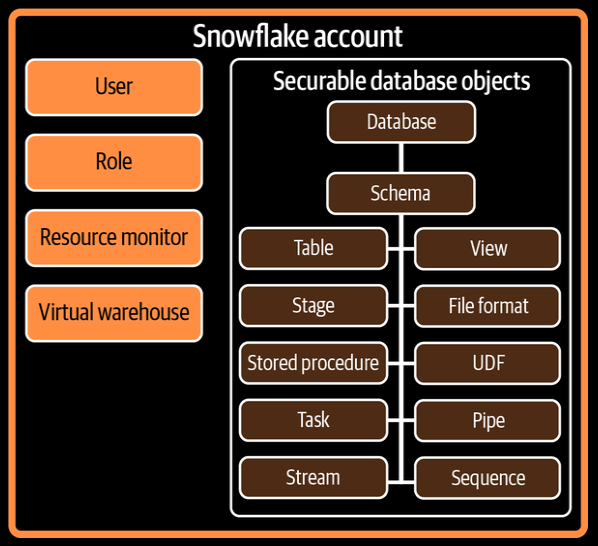

- A Snowflake securable object is an entity for which you grant access to specific roles.

- Roles, which have been granted access privileges are assigned to users.

- A Snowflake user can be either an individual person or an application.



- The database logically groups the data while the schema organizes it. 

- There are two types of Databases in Snowflake:
  
  - <u>Permanent DB (default)</u>: Up to 90-day time travel period and up-to seven days fail-safe period.
  
  - <u>Transient DB</u>: Only one-day time travel period with no fail-safe support.

- Time Travel period is the time during which table data within the database can queried at a historical point in time.

- The default time-travel period is one day. For Enterprise and Higher editions, time-travel period is up to 7 days.

- Snowflake's fail-safe data recovery service provides a seven-day period during which data from permanent database and database objects may be recoverable by Snowflake.

- Time-travel data can be accessible by user, while fail-safe data is only recoverable by Snowflake employees.

- Time-travel and fail-safe features incures storage cost.

- Whenever you create a new database, that database is automatically set as the active database for the current session. It’s the equivalent of using the`USE DATABASE` command.

- Transient tables are designed to hold transitory data that doesn't need the same level of protection and recovery as permanent tables.

- Transient tables can be created within permanent database, but permanent table can not be created inside transient database.

- All tables created in a transient schema are transient by default.

- Every Snowflake account comes with two databases:
  
  - <u>SNOWFLAKE</u>: 
    
    - System-defined, read-only, shared database provides object metadata and usage metrics about the account.
    
    - Only ACCOUNTADMIN role has access to this database by default. Though privileges can be granted to other roles. 
    
    - No data storage charge.
  
  - <u>SNOWFLAKE_SAMPLE_DATA</u>: 
    
    - Shared DB. Imported to the account and can't be deleted.
    
    - Shared from the Snowflake SFC_SAMPLES account.
    
    - Read only and can't performed any DDL or DML on the database objects.
    
    - Only supports query and view of data.
    
    - Doesn't incure storage cost.

- To change the schema of a table:
  
  ```sql
  ALTER TABLE DEMO3B_DB.PUBLIC.SUMMARY
  RENAME TO DEMO3B_DB.BANKING.SUMMARY;
  ```

- There is a different types of schema called *managed access schema.* In a managed access schema, the owner manages grants on the objects within a schema such as tables and views, but doesn't have any of the USAGE, SELECT or DROP privileges on the objects.

- To create a managed access schema:
  
  ```sql
  CREATE OR REPLACE SCHEMA <schema-name> 
  WITH MANAGED ACCESS;
  ```

- In Managed Access schemas, <u>object owners are unable to issue grant privileges. Only the Schema owner or a role with the `MANAGE GRANTS` privilege assigned</u> to it can manage the grant privileges.

- <u>The `SECURITYADMIN` and `ACCOUNTADMIN` roles inherently have the  `MANAGE GRANTS` privileges and can manage the grant privileges on all managed schemas.</u>
