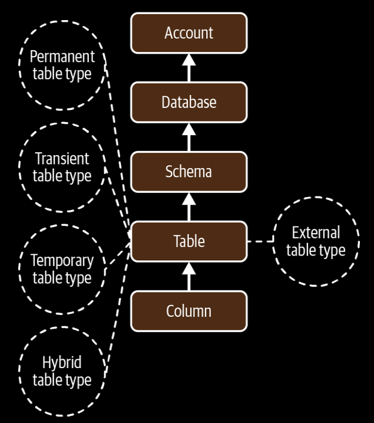

**Object Hierarchy in Snowflkae**

- **Types of Snowflake Tables**
  
  - Permanent table
  
  - Transient table
  
  - Temporary table
  
  - External table
  
  - Materialized tables
  
  - Hybrid tables

- Hybrid tables support the new Unistore workload.

- Snowflake temporary tables only exist within the session in which they were created and are frequently used for storing transitory data such as ETL data.

- Snowflake External tables gives the ability to directly process or query the data that exists elsewhere without ingesting it into Snowflake, including data that lives in a data lake.

- Using Hive Metastore connector we can connect to Hadoop environment from Snowflake.

- Delta Lake is a table format on a data Lake Spark-based platform. A Snowflake External table can be created which will reference your Delta Lake cloud storage locations.

- Apache Iceberg tables have addressed many of the challenges associated with object stores and it a good choice as data lake.

- Hive keeps track of data at the folder level (which leads to performance issue), whereas Iceberg keeps track of a complete list of all files within a table using a persistent tree structure.

- Materialized tables are the logical progression of streams, that gives the user the ability to improve their incremental materialization experience.

**Snowflake Tables**

1. **Permanent Tables**
   
   - *Use*
     
     - Store core business data that needs long-term persistence
     
     - Support features like Time Travel and Fail-Safe for data recovery and historical analysis.
     
     - Used for data warehousing, analytics and operational data stores.
   
   - *Limits*
     
     - Consume storage space and incur charges based on their size.
     
     - Data modification requires careful consideration due to potentially impacting historical queries.

2. **Temporary Tables**
   
   - *Use*
     
     - Store intermediate data generated during calculations or transformations.
     
     - Useful for quick data manipulating within a single session.
     
     - Not visible to other users or sessions.
   
   - *Limits*
     
     - Data disappears when the session ends and is unrecoverable.
     
     - Limited features compared to permanent tables.
     
     - Not suitable for storing crucial or long-term data.

3. **Transient Tables**
   
   - *Use*
     
     - Similar to temporary tables in purpose but stored across different sessions for a defined period.
     
     - Useful for a sharing intermediate data among users within a limited timeframe.
     
     - Automatically dropped after the specified retention period.
   
   - *Limits*
     
     - Do not support Time Travel or Fail-Safe like permanent tables.
     
     - Limited availability beyond the retention period.
     
     - Not ideal for long-term data sharing or archiving.

4. **External Tables**
   
   - *Use*
     
     - Access data stored in external files or databases without physically moving it into Snowflake.
     
     - Reduce storage costs and simplify data management in hybrid cloud environments.
     
     - Support various file formats and cloud storage platforms.
   
   - *Limits*
     
     - Performance may be slower compared to native Snowflake tables.
     
     - Limited functionalities for transformations and manipulations directly on external data.
     
     - Require careful configuration and access management for security purposes.

5. **Materialized Tables (Now Dynamic Tables)**
   
   - *Use*
     
     - Pre-calculated results of complex joins, aggregations or transformations from other tables.
     
     - Faster query performance for frequently-use calculations.
     
     - Improved concurrency and resource efficiency by offloading processing from base tables.
   
   - *Limits*
     
     - Increased storage costs compared to base tables due to data redundancy.
     
     - Requires maintenance to keep them synchronized with changes in base data.
     
     - Not suitable for infrequently used of highly-mutable data.

6. **Hybrid Tables**
   
   - *Use*
     
     - Introduce trnasactional capabilities (single-row operations) within Snowflake, which was traditionally optimized for analytics.
     
     - Faster write and update performance for operational workloads.
     
     - Enable integration with OLTP-style applications within the Snowflake platform.
   
   - *Limits*:
     
     - Currently in limited availability and subject to change.
     
     - Not a complete replacement for traditional OLTP databases due to differences in features and architecture.
     
     - May hae different pricing and resource management than standard Snowflake tables.