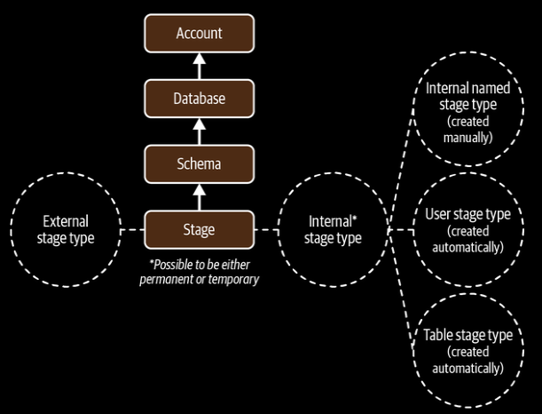

- Stages are Snowflake objects that <u>point to a storage location</u>, either internal to Snowflake or on external cloud storage.

    

- Used as an intermediate step to load files to Snowflake tables or to unload data from Snowflake tables into files.

- There are <u>two types</u> of Snowflake stages: 

    - Internal Stage

        - Used to store data files internally on cloud storage managed by Snowflake.

        - Internal Stages are of two types: *Named Stages*   and *User or table Stages*.

    - External Stage

        - Reference to data files that are stored in a location outside of Snowflake i.e. private/public cloud like Amazon S3 buckets, GCP buckets, Azure containers.

- User stages and tables stages, both of which are types of internal stages, are automatically provided for each Snowflake account.

- A table stage is tied to the table itself and is not a separate database object.

- `temporary` keyword can be used to create a session-based named stage object.

- User stage is referenced by `@~`.

- Table stage can be referenced as `@%<name of table>`.

- <u>Table stages are useful if multiple users need to access the files and those files only need to be copied into a single table</u>.

- <u>User stage is useful when the files only need to be accessed by one user but will need to be copied into multiple tables.</u>

- <u>User and table stages cannot be altered or dropped</u>, and neither of these stages supports settings the file format.

- Table stages do not support transforming the data while loading it.

- To list a user stage: `ls@~;` or `LIST @~;`.

- <i>Internal named stages</i> are database objects, they can be used not just by one user but by any user who has been granted a role with the appropriate privileges.

- Internal named stages and external stages can be created as either a permanent or temporary stage.

- When a temporary external stage is dropped, no data files are removed as they are stored externally. Only the stage object is dropped from Snowflake.

- By dropping temporary internal stages, both files and object is dropped and are not recoverable.

- When using stages, **file formats** are associated with the stage to store all the format information we need for loading data from files to tables.

- <u>Default file forma is CSV</u>. And other file formats like JSON, AVRO, ORC, Parquet, and XML can be created. 

- Data is always in an encrypted state, whether it is in transit to a stage or stored in a table.

|Characteristics|Internal Named Stage | Internal User Stage| Internal Table Stage|External Stage|
|--|--|--|--|--|
|Stage is a database object?|Yes|No|No|Yes|
|Default type|Permanent|Permanent|Permanent|Permanent|
|Temporary type possible?|Yes|Yes|Yes|No|
|Creation method|User-created|Automatic|Automatic|User-created|
|How to reference|`stage_name`|`@~`|`@$<table-name>`|`stage-name`|
|Drop/alter stage possible?|Yes|No|No|Yes|
|Data actually stored in stage?|Yes|No|No|No|
|Supports setting file formats?|Yes|No|No|No|
|Directory tables possible?|Yes|No|No|Yes|