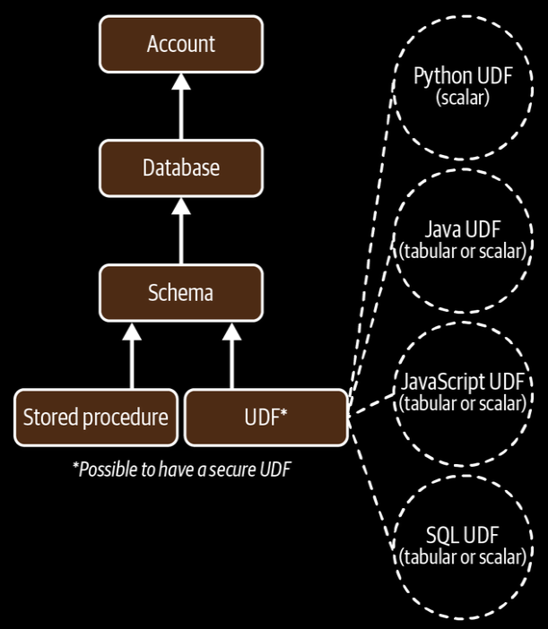

- Stored procedures and UDFs are used to achieve functionalities that are not possible with Snowflake's built-in functions.

- UDFs can return multiple values (tabular).

- Stored procedures return only a single value.

- Stored procedures return scalar value, but can also return multiple values if the return type is a variant.

- UDFs can be created using SQL, JavaScript, Python and Java.

- It is possible to create secure UDFs.



**Difference between UDFs and Stored Procedures**:

| Uer Defined Functions                                             | Stored Procedures                                                 |
| ----------------------------------------------------------------- | ----------------------------------------------------------------- |
| Called as part of the SQL statement.                              | Called as an independent statement using CALL statement.          |
| Can return tabular values.                                        | Returns scalar value.                                             |
| To perform some calculation, include a value for every input row. | To perform database operations such as SELECT, DELETE, or CREATE. |

- The CALL statement can call only one stored procedure per statement.

- Snowflake supports four languages for UDFs i.e. SQL, JavaScript, Python and Java.

- Python UDFs are limited to returning scalar results.

- SQL, JavaScript, and Java UDFs can return either scalar or tabular results.

- A SQL UDF evaluates SQL statement and can refer to other UDFs, but <u>cannot refer to itself either directly or indirectly</u>.

- JavaScript UDFs have access to the basic standard JavaScript library needed to create arrays, variables, and simple objects.

- Math operations and error handling operations cannot be performed with JavaScript UDFs, because Snowflake doesn't support external libraries.

- JavaScript UDFs, and Procedures can be found:
  
  ```sql
  USE ROLE SYSADMIN;
  
  CREATE OR REPLACE DATABASE DEMO3C_DB;
  
  CREATE OR REPLACE FUNCTION JS_PROPERTIES()
  RETURN string LANGUAGE JAVASCRIPT AS 
      $$ RETURN Object.getOwnPropertyNames(this); $$;
  
  SELECT JS_PROPERTIES();
  ```

- Secure UDFs are the same as nonsecure UDFs, but a Secure UDF hides its DDL statement from the consumer.

- Secure UDFs have limitation on performance functionality due to some optmizations being bypassed.

- Only secure UDFs can be shared.

- JavaScript secure UDFs are often used for data cleansing, address matching or other data manipulation operations.

- A secure SQL UDF can run queries.

- For a secure shared UDF, the queries can only be run against the provider's data.

- When a provider shares a secure UDF with a customer, the cost of data storage for any tables being accessed by the function is paid by the provider, and the <u>compute cost is paid by the consumer</u>.

- Market basket analysis is a common use of secure SQL UDFs.

- *Note*:
  
  - Secure UDFs should be used for instances in which data privacy is of concern and you want to limit access to sensitive data.

- Stored procedures allow you to extend Snowflake SQL by combining it with JavaScript in order to include branching and looping, as well as error handling. 

- Stored procedures, which must be written in JavaScript, can be used to automate tasks that require multiple SQL statements performed frequently.

- Stored procedures are great for batch actions because a stored procedure runs by itself and similar to a trigger, can be conditionally tied to database events.
