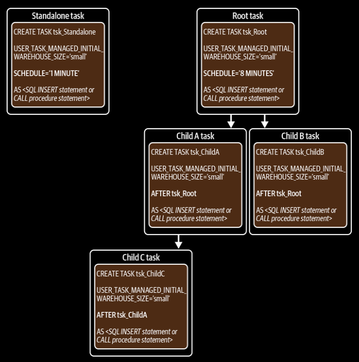

- Created tasks are suspended by default.
  
- Snowflake tasks can be completed by using:
  
  - User's compute resources (virtual warehouse)
  
  - Snowflake serverless compute model.

- The option to enable the serverless compute model must be specified when the task is created.

- Execution of task can depend on its parent task.

- There is no even source that can trigger a task.

- Each child task is triggered by one predecessor task.

- Each individual task is limited to a single predecessor task but can have up to 100 child tasks.

- A task tree is limited to 1000 tasks in total, including the root task.

- Use `SYSTEM$TASK_DEPENDENTS_ENABLE` function rather than resuming each task individually with `ALTER TASK RESUME` command.

- By default, Snowflake ensures that only one instance of a particular tree of tasks is allowed to run at one time.
  
  This behaviour can be changed using `ALLOW_OVERLAPPING_EXECUTION` parameter in the root task to `TRUE`.

- Three Snowflake task functions to retrieve information about tasks:
  
  - `SYSTEM$CURRENT_USER_TASK_NAME`: Returns the name of the task currently executing when invoked from the statement or stored procedure defined by the task.
  
  - `TASK_HISTORY`: Returns task activity within the las seven days or the next scheduled execution within the next eight days.
  
  - `TASK_DEPENDENTS`: Returns a list of child tasks for a given root task.

- Tasks can be scheduled at the lowest granulation to one minute.

